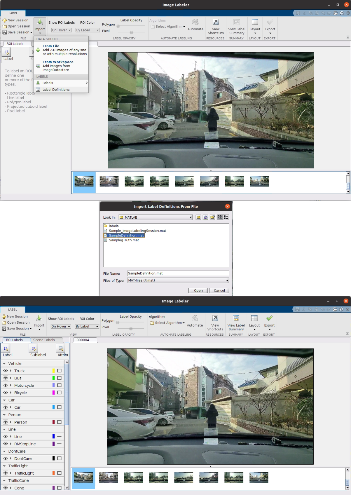

# restore.m

- 작성되어있는 txt 파일을 기반으로 이미지에 라벨을 그림
- 본 구조는 write_label에서 만들어 낸 csv --- json 구조를 기반으로 복원한다.
  - 활용된 원리를 기반으로 하면 다른 구조에도 적용 가능


### 사전 작업

- Matlab Image Labeler에서 생성된 gTruth는 DataSource, LabelDefinition, LabelData의 구조가 groundTruth라는 Datastore 구조로 묶여있다.
- 우리가 여기서 필요한 것은 LabelData 하나이며, 이 하나를 위해서 저 세가지를 전부 만드는 것은 비효율적 과정이다.
- 따라서 Labeler에서 틀이 될 gTruth를 임시로 생성한다.



- 이미지와 사전에 만들어둔 LabelDefinition을 불러와서 이를 Export한다.
  - 이 Session에 대한 저장은 필요 없다.
  - LabelDefinition은 Export - LabelDefinition - To File을 통해 mat 파일로 생성할 수 있다.
- 이렇게 생성한 Export 를 test_restoring.mat 이라 저장하여 진행하였다.


### 본문


```matlab
file_input = open('/home/ri/workspace/MATLAB_Labeler/data/test_restoring.mat');
variableNames = {'Category', 'y', 'x', 'h', 'w', 'dist_'};
TextscanFormats = {'%s', '%f', '%f','%f','%f','%f'};
labels_datastore = datastore('/home/ri/workspace/Sample_Result_22.03.11/220209/magok/2022-02-09-19-54-16/label/', 'TextscanFormats', TextscanFormats, 'ReadVariablenames', false, 'VariableNames', variableNames);
label_files = labels_datastore.Files;
fileattrib('/home/ri/workspace/MATLAB_Labeler/data/test_restoring.mat', '+w');
LabelData = file_input.gTruth.LabelData;
LabelDefinition = file_input.gTruth.LabelDefinitions;
```

- 사용할 파일들을 정리
- datastore를 통해 다수의 라벨들을 하나로 묶으며 labels_files에 labels_datastore 안에서 파일명만 저장한다.
  - datastore 함수를 이용하면 파일 명만 저장되는 것이 아니라 경로 및 각종 속성들까지 같이 저장되므로, 우리가 필요한 파일명만 따로 꺼내서 저장한다.
  - Datastore를 만들 때 파일을 읽어올 방식과 변수들을 사전에 지정한다.
    - TextscanFormats - Category, y, x, h, w, dist_ 를 읽어오므로 이에 맞는 포맷을 미리 지정해줌
    - Readvariablenames를 false로 함으로 인해 우리가 지정한 변수명들을 수동으로 사용할 수 있게 해준다.
    - variableNames에서 변수명들을 지정하고 사용하도록 한다.
- 저장된 gTruth 는 기본적으로 read-only 상태이다. 이를 writable로 바꿔준다.
- gTruth.LabelDefinition과 gTruth.LabelData를 저장한다.


```matlab
for file_idx = 1:length(labels_files)	//(1)번 for라 함. 마지막에 end 존재
    labels = fileread(labels_files{file_idx});	//파일마다 수행 
    labels = split(labels, '---');			  // --- 로 split 하여 csv, json을 나눔
    labels_box = split(labels{1}, newline);	  // csv를 labels_box에 입력
    
    for box_index = 1:length(labels_box)		//각각의 labelbox에 대해 수행
        box_data = split(labels_box(box_index), ',');	//', '로 나누어진 정보를 읽기 위함
        if isempty(box_data{1})		//labelbox가 없을 때
            continue
        end
        box_name = box_data{1};		//box의 클래스
        x = str2double(box_data{3});	//y, x, h, w로 배치된 것을 x, y, w, h에 각각 대입
        y = str2double(box_data{2});	//이 때 string으로 읽어오므로 str2double을 통해 실수로 바꿔줌
        w = str2double(box_data{5});
        h = str2double(box_data{4});
        box_position = [x y w h];		
    
        box_name_number = find(strcmp(LabelDefinition{:, 5}, box_name));  //description으로부터 Name 번호 찾기
        box_label_name = LabelDefinition{:, 1}{box_name_number};	//Name 번호로 Name 찾기
        LabelData{:, box_name_number}{file_idx} = \
           [LabelData{:, box_name_number}{file_idx}; box_position];	//데이터 입력
    end
```

- 각각의 파일들 중 ---을 기준으로 해서 csv 형태로 작성된 박스를 처리하는 영역
- 입력받은 csv 파일은 ', '를 기준으로 분류, y, x, h, w, dist 값을 입력받는다.

- string으로 읽어오므로 double로 바꿔서 x, y, w, h 자리에 맞게 저장을 하며 double matrix로 저장한다.
- Definition의 5번째 열은 description이 저장되어있는 열이며, Label 저장을 할 때 이 열의 내용을 이름으로 하여 저장하였기 때문에 Description을 통해 Label의 Name을 찾아낸다.

- LabelData 에서 분류는 열로 구분되므로 LabelData에 찾은 box number를 통해 구한 분류의 위치에 box position을 추가하여 box를 작성한다.


```matlab
    if labels{2} == newline		//차선이 없을 때의 시행되는 영역
        continue
    else
        labels_line = jsondecode(labels{2});
    end
```

- label을 ---으로 split 한 결과의 두 번째 구조에는 json으로 작성되어있는 string이 저장되어 있다.
- 만약 이미지에 차선이 없을 경우 이 부분이 작성된 것이 없으므로 비어있을 것이다.
- json 구조가 존재하면 jsonencode를 써서 json 형식으로 string을 변환한 후 labels_line에 저장한다


```matlab
	for line_index = 1:length(labels_line)
        line_list = labels_line{line_index};
        line_name = labels_line{line_index}{1};		//line의 이름을 저장
        line_point_array = [];		//cell 구조로 저장된 line을 담기 위한 matrix
        for line_point = 2:length(line_list)	//line_list의 두번째 부터 point가 찍힘	
            x = line_list{line_point}(1);
            y = line_list{line_point}(2);
            line_point_array = [line_point_array; x y];	//point들을 저장
        end
        
        line_name_number = find(strcmp(LabelDefinition{:, 5}, line_name));	//box의 Description으로부터
        line_label_name = LabelDefinition{:, 1}{line_name_number};			//Name을 찾는 과정과 동일
        LabelData{:, line_name_number}{file_idx} =
           [LabelData{:, line_name_number}{file_idx}; line_point_array];	
    end
end	//(1)번 for의 end
```

- label에서 ---을 기준으로 해서 json 형태로 작성된 라인을 처리하는 영역
- MATLAB Image Labeler에서 line 타입은 cell 형태로 저장되므로 cell 구조를 이용하기 위해 line_point_array라는 변수를 생성하여 활용한다.
- Line 타입은 같은 선 상의 point들이 하나의 matrix 구조로 저장되어 있으므로, 이를 위한 matrix를 line_point_array라고 지정하여 저장한다.
  - line_point_array에 저장된 point들이 모여 하나의 선을 구성한다.
  - 같은 종류의 선들이 모여 하나의 cell 아래에 저장되어있다.
- 이러한 과정이 읽어온 매 파일마다 반복된다.


```matlab
New_Label_Data = LabelData;

New_gTruth = groundTruth(file_input.gTruth.DataSource, LabelDefinition, New_Label_Data);
```

- 생성된 Label Data를 New_Label_Data에 대입
- New_gTruth라는 groundTruth를 생성
  - 이때 groundTruth는 DataSource와 LabelDefinition은 같으나 라벨 위치 정보가 저장된 New_Label_Data를 LabelData로 활용한다.
